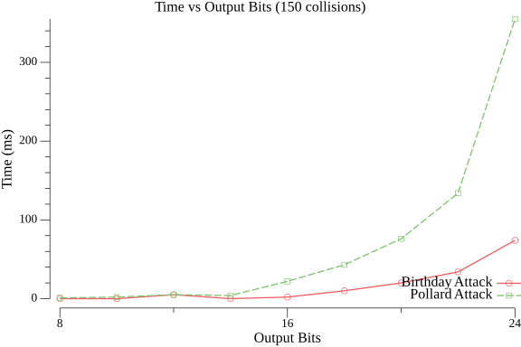
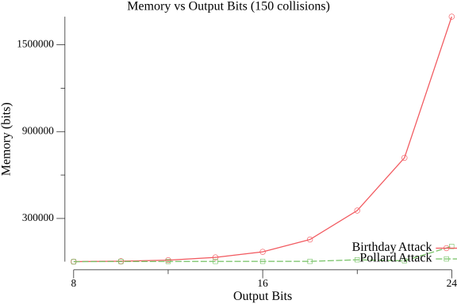

# Лабораторная работа №2: Атаки на хеш-функции

В данной лабораторной работе были реализованы и проанализированы два алгоритма поиска коллизий в хеш-функциях:

- **Атака дней рождений** (Birthday Attack)
- **Атака Полларда на коллизии** (Pollard's Attack)

Цель исследования — сравнить эффективность этих методов по скорости работы и потреблению памяти.

В качестве хеш-функции использовался **SHA-256**, но с ограниченным количеством выходных бит (от 8 до 24). Это сделано дл того, чтобы поиск коллизий был не очень долгим.

## Реализация
В проекте реализованы следующие функции:
- `SHA_xx(msg []byte, outbits int)` - усечённая хэш-фукция на основе SHA-256
- `BirthdayAttack(num int, outBits int)` — атака Дней рождений.
- `PollardAttack(outBits int, distinguishedBits int, numColls int, numWorkers int)` — атака Полларда.

Программа тестировалась с различными значениями `outputBits`, от 8 до 24 бит с шагом 2 бита. Найденные 100 коллизий для атаки Полларда с выходным значением хэш-функции, равным 24 бита(max), записываются в файл `collisions_24.txt` в шестнадцатеричном формате. 

## Эксперименты
В ходе эксперимента проводилось измерение времени выполнения атак и приблизительная оценка потребляемой памяти. Результаты представлены в виде сравнительных графиков.

### Время выполнения атак

### Используемая память

Графики показывают, что Birthday Attack работает быстрее на бОльших значениях Output Bits, но требует больше памяти. Pollard`s Attack, напротив, более экономична по памяти, но выполняется дольше. Вид графиков времени у обоих методов близок к экпоненициальному, что согласовывается с теорией. Однако атака Полларда требует значительно меньше памяти(линейная зависимость), нежели атака Дней рождений(экспоненциальная зависимость).
