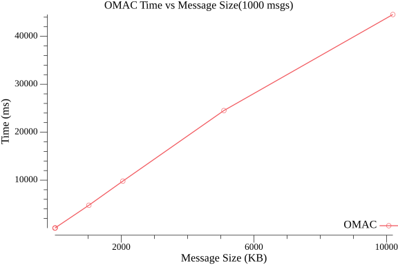
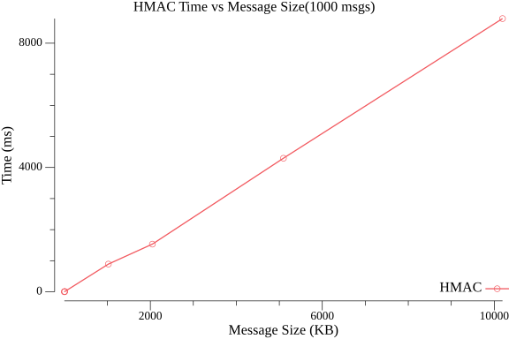
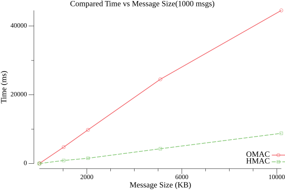

# Лабораторная работа №3: Коды аутентичности

## Реализация
В проекте реализованы следующие функции:
- `MacAddBlock(dataBlock []byte)` - обновляет внутреннее состояние MAC для блока данных
- `MacFinalize(lastBlock []byte)` — завершает вычисление MAC и возвращает тег
- `ComputeMac(message []byte)` — вычисляет MAC для данных за один вызов, используя MacAddBlock и MacFinalize.

В данной лабораторной работе реализованы три алгоритма выработки кода аутентичности сообзения (MAC): OMAC, Truncated-MAC и HMAC, с использованием алгоритма AES (с 128-битным ключом) и хэш-функции SHA-256.

Для OMAC используется паддинг, представляющий собой дописывание «1000…0», для Truncated-MAC применяется стандартный PKCS7-паддинг, а для HMAC он вообще не требуется. 

## Эксперимент
В экспериментальной части работы MAC вычисляется для произвольного сообщения длиной 2,5 блока, после чего проводится проверка корректности алгоритма. Для каждой реализации тестируется, что при изменении одного бита в сообщении вычисленный тег не совпадает с оригинальным.

Также была проведена оценка производительности MAC для сообщений различных размеров (0.1, 1, 10, 1024, 2048, 5096, 10192 КБ). Замерялось время вычисления 1000 случайных сообщений. Были построены соответсвующие графики зависимости времени вычисения от длины сообщений. Графики показали линейную зависимость(О(n)) времени выполнения от размера входного сообщения. На сравнительном графике видно, что алгоритм HMAC выполняется быстрее при увеличении длины сообщения, нежели алгоритм вычисления OMAC. Ниже приведены данные графики.

### Время вычисления OMAC

### Время вычисления HMAC

### Сравнительный график

